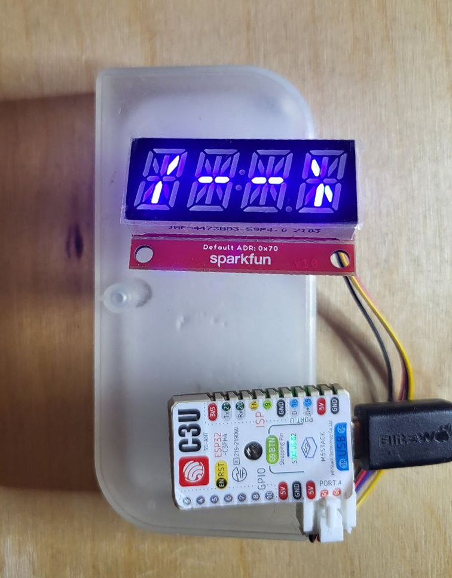
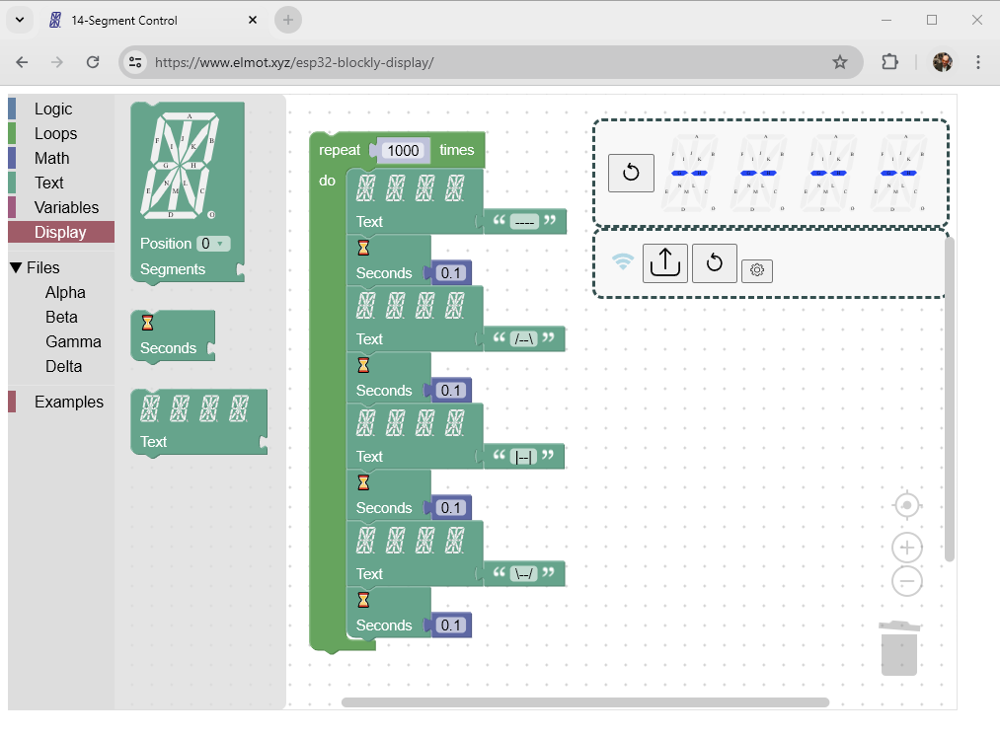

4-Letter 14-Segment indicator toy
====

Hardware
----

* [M5 Stamp-C3U](https://docs.m5stack.com/en/core/stamp_c3u) - ESP32-C3 MCU module
* [SparkFun Qwiic Alphanumeric Display - Blue](https://www.sparkfun.com/products/16917)
* [Grove to STEMMA QT / Qwiic / JST SH Cable - 100mm long](https://www.adafruit.com/product/4528)

Software & SaaS services
----

* [Google Blockly](https://developers.google.com/blockly) is used to edit and run display programs online.
   * The blocks are converted to JavaScript code to be run in the browser window
   * The blocks are converted to Python code to be run on MCU side
* [GitHub pages](https://pages.github.com/) hosts the web part
* [EMQ Free Public MQTT Broker](https://broker.emqx.io) helps to exchange data between web- and hardware- part
* [Micropython](https://micropython.org/) is run on the ESP32 MCU and handles both the display and MQTT connection

How2Run
----
* Solder the Grove connector (shipped with the module) to M5 Stamp-C3U *Port A*
* Connect the display module to the MCU module
* Connect the MCU module to your computer
* Flash latest [Micropython](https://micropython.org/download/ESP32_GENERIC_C3/) to the MCU module. 
[JS ESPTool](https://espressif.github.io/esptool-js/) is a handy tool for it. 
Note that *.bin* file should be flashed at address *0x0000*
* Write your own *secrets.py* file based on the template [secrets_template.py](micropython/src/secrets_template.py).
There should be your specific Wi-Fi SSID, Wi-Fi password, and a random UUID as a MQTT connection token. 
* Upload newly created *secrets.py* to the MCU module filesystem. 
You may use either 
[PyCharm](https://www.jetbrains.com/pycharm/) with 
[MicroPython plugin](https://plugins.jetbrains.com/plugin/9777-micropython), 
[Thonny](https://thonny.org/), or [mpremote](https://docs.micropython.org/en/latest/reference/mpremote.html)
* Upload [MicroPython code](micropython) to the MCU board
* **TBD** set token to the web part  
